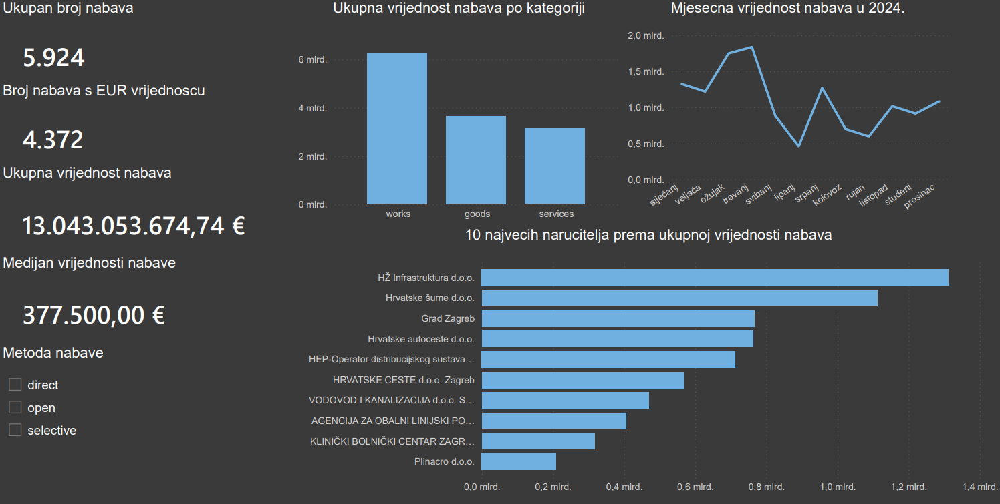

# Croatian Public Procurement Analysis

Portfolio projekt za analizu podataka o hrvatskoj javnoj nabavi iz 2024. godine.

## Tehnologije

- Python
- pandas
- PostgreSQL
- SQL
- Power BI
- pytest

## Proces obrade podataka

1. Učitavanje izvornog CSV-a
2. Profiliranje podataka
3. Odabir i preimenovanje stupaca
4. Pretvaranje datuma i iznosa
5. Spremanje očišćenih podataka
6. Uvoz u PostgreSQL
7. SQL analiza
8. Izrada Power BI dashboarda

## Pokretanje testova

```powershell
python -m pytest -v
```

## Dashboard


